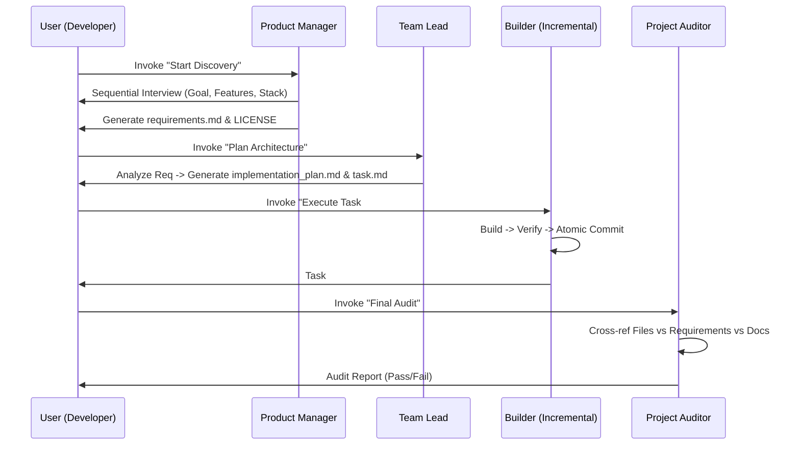
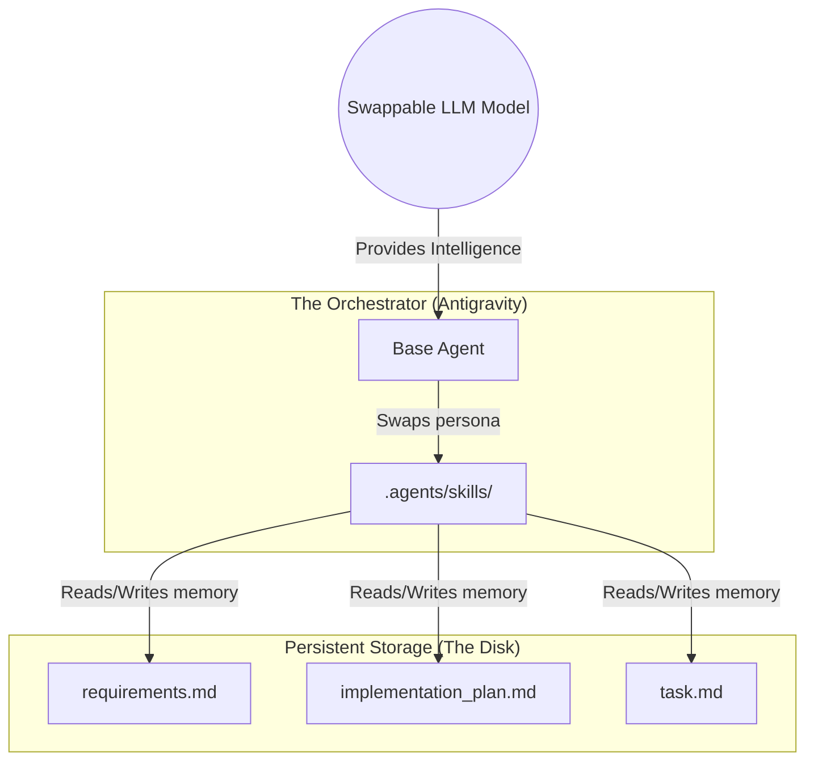

# Beyond the Chatbox: Artifact-Driven Orchestration with Antigravity

In the rapid evolution of 2026, the AI agentic landscape has reached a crossroads. On one hand, we have the "Black Box" agents—tools like Claude Code that provide incredible, conversational speed but often leave developers guessing when complex, multi-file refactors go off the rails. On the other, we have traditional, rigid frameworks that feel more like handcuffs than help.

Today, we are introducing **Antigravity Developer Skills**: a framework built on the philosophy of **Artifact-Driven Orchestration**.

---

## 1. The Core Philosophy: Stateless Agentics

Most agentic platforms treat the "Conversation History" as the source of truth. If the context window fills up, or if you switch from a high-reasoning model to a faster one, the agent "forgets" the nuance of the plan.

Antigravity flips this. We decouple the **Logic** from the **Memory**.

- **Persistent Memory**: The state of your project isn't hidden in a vector database or an ephemeral chat thread. It lives on your disk in human-readable Markdown artifacts: `requirements.md`, `task.md`, and `implementation_plan.md`.
- **Skills as Roles**: We don't spawn a dozen sub-agents. We equip a single, highly capable agent with specific **Personas**—constraining its behavior to a specific stage of the SDLC (Software Development Life Cycle).

> [!TIP]
> This "Stateless" approach means you can crash your terminal, switch computers, or swap from a $20/month model to a free-tier model, and your agent picks up **exactly** where it left off by reading the artifacts.

---

## 2. The 2026 Competitive Landscape

How does Antigravity stack up against the Goliaths of the agentic world?

| Feature | Claude Code | Cursor (IDE) | Kiro CLI | Antigravity |
| :--- | :--- | :--- | :--- | :--- |
| **Logic Source** | Conversation History | Internal Index | Spec Files | **Markdown Artifacts** |
| **Autonomy Style** | Pure Agentic | Integrated UI | Rigid Handoffs | **Structured Loops** |
| **Context Safety** | High Risk (Drift) | Moderate | Ironclad | **Ironclad (on-disk)** |
| **Model Choice** | Anthropic Only | Mixed | Model-Specific | **Agnostic (Dynamic)** |
| **Human Role** | Monitor | Copilot | Gatekeeper | **Architect & Owner** |

### Why Antigravity wins the "Entropy War"
Claude Code is fantastic for rapid prototyping (the "Exploration" phase). However, it often suffers from the **"Big-Bang Commit"**—where the agent edits 12 files and expects you to review a 1,000-line diff. Antigravity's `incremental-orchestrator` enforces atomic, issue-linked commits, ensuring that your git history remains as clean as your code.

---

## 3. The Persona System: How They Interact

Antigravity uses a modular sequence of personas. Instead of one agent trying to do everything, it enters a "Mental Model" for each stage.

### Meet the Squad: A Carousel of Personas

````carousel
#### 🎨 Product Manager
**Role**: The Discovery Specialist.
**Goal**: Iterate through sequential questioning to convert a vague idea into a rock-solid `requirements.md`.
**Interaction**: Grabs the user's vision and forces it into reality before a single line of code is written.
<!-- slide -->
#### 📐 Team Lead Orchestrator
**Role**: The System Architect.
**Goal**: Deconstruct `requirements.md` into a technical `implementation_plan.md` and a granular `task.md`.
**Interaction**: Assigns tools and skills to specific tasks, ensuring a logical build order.
<!-- slide -->
#### 🛠️ Incremental Orchestrator
**Role**: The Precision Builder.
**Goal**: Execute the checklist one atomic task at a time.
**Interaction**: Enforces a strict loop of `Build -> Test -> Snapshopt` to keep git history pristine.
<!-- slide -->
#### 🔍 Project Auditor
**Role**: The Quality Gatekeeper.
**Goal**: Validate the physical codebase against the documentation and original requirements.
**Interaction**: Issues an Audit Report. If things don't match, the builder goes back to work.
````

### Persona Handoff Logic (Sequence Diagram)



### System Architecture
The relationship between Artifacts (Disk), Skills (Personas), and the LLM (Reasoning Engine).



---

## 4. Implementation Deep-Dive: Model-Agnostic Routing

One of the most powerful features of Antigravity is the ability to route tasks to the most cost-effective model without manual intervention. Why use a flagship model to fix a typo in your README?

### How it Works: The Pre-Execution Hook
Antigravity looks for a `pre_task.sh` hook. You can tag your skills with an `ideal-model` in the YAML frontmatter.

**Example `pre_task.sh` Hook:**
```bash
#!/bin/bash
# .agents/hooks/pre_task.sh
SKILL_FILE=".agents/skills/$1/SKILL.md"

if [ -f "$SKILL_FILE" ]; then
  # Extract the model from YAML metadata
  MODEL=$(grep "^ideal-model:" "$SKILL_FILE" | awk -F"'" '{print $2}')
  
  if [ ! -z "$MODEL" ]; then
    echo "Routing to optimal model: $MODEL"
    export ACTIVE_LLM_MODEL="$MODEL"
  fi
fi
```

By tagging `markdown-formatter` as `gemini-flash` and `incremental-orchestrator` as `claude-3-opus`, you optimize your performance-to-cost ratio automatically.

---

## 5. Security & Guardrails: The Safety First Approach

We believe in **"Trust, but Verify."** Antigravity implements several hard guardrails to prevent codebase corruption:

1. **Atomic Snapshots**: The agent is forbidden from editing multiple unrelated files. Every change must be linked to a specific `task.md` issue.
2. **Mandatory Local Verification**: The `incremental-orchestrator` must run your tests/build scripts *before* it is allowed to commit.
3. **The "Human Code-Owner" Rule**: The agent can create Pull Requests, but it is **forbidden** from merging them. A human must always perform the final code review.
4. **Branch Isolation**: All logic happens in feature branches. The `main` branch is protected by the agent's own internal rules.

---

## 6. Getting Started with Antigravity

Ready to transition from "Chat-Driven Development" to "Artifact-Driven Orchestration"?

1.  **Download as ZIP**: [Visit the Repo](https://github.com/USER/antigravity-dev-skills) and download to avoid git history pollution.
2.  **Initialize**: Run `git init` in your new folder.
3.  **Start the Interview**:
    > *"Adopt the `product-manager` skill and interview me for a new project."*
4.  **The Loop**: Follow the persona handoffs from PM -> Team Lead -> Builder -> Auditor.

---

## Conclusion

Antigravity isn't just about making an agent faster; it's about making it **professional**. By moving the source of truth from the chat bubble to the artifact, we ensure that your AI is as disciplined as your best engineer.

**[Check out the Repository on GitHub](https://github.com/USER/antigravity-dev-skills)**

---
*Authored by the Antigravity Team | April 2026*
