# How I Tamed the Chaos of Agentic Coding with Antigravity

I'll be honest: my first few weeks using autonomous AI agents were a mix of awe and absolute terror. 

I started with the big names—Claude Code and Cursor. They felt like magic. I'd type a prompt, and the agent would go to work, context-switching through a dozen files like a senior dev on caffeine. But as my project grew, the "magic" started to leak. I'd hit the context window limit and the agent would suddenly "forget" why we chose a specific database schema. Or worse, it would drop a "Big-Bang Commit" on me—editing 15 files at once without a single test run—leaving me to untangle the mess.

That's when I found **Antigravity**. It's not just another agent; it's a framework that forces your AI to act like a disciplined engineer. Here’s how I use it to keep my sanity.

---

## The Philosophy: Why I Switched to "Stateless Agentics"

The biggest problem with most agents is that they treat the **Conversation History** as the source of truth. If you switch models or start a new thread, that truth is gone.

Antigravity fixes this by moving the state out of the LLM and onto your disk. We call it **Artifact-Driven Orchestration**.

- **Persistent Memory**: The "brain" of my project isn't hidden in a cloud buffer. It lives in `requirements.md`, `task.md`, and `implementation_plan.md`. 
- **Roles, Not Sub-Agents**: I don't need a complex network of agents talking to each other. I just need my one agent to stick to a specific **Persona** (The Architect, The Builder, The Auditor) based on where we are in the cycle.

> [!NOTE]
> For me, the "Stateless" nature is the killer feature. I can swap from a high-reasoning model for logic to a fast, cheap model for formatting, and the agent doesn't miss a beat because it reads the exact same artifacts.

---

## ⚡ 60-Second Setup: How I Integrated It

I found that there are two main ways to get this into your workflow. 

### Path A: Drop-in to an Existing Repo
This is what I did for my React app. 
1. **Copy the Folder**: I just copied the `.agents/` directory from the framework into my project root.
2. **Start Talking**: Since the skills are file-based, my agent immediately recognized the new personas.

### Path B: Fresh Start
If I'm starting a greenfield project, I **Download the ZIP** of the framework, extract it, and rename it. This ensures my `git init` starts with a clean slate.

---

## 💬 How I Talk to My Agent

It isn't about complex prompting; it's about shifting the agent's state. My conversations usually look like this:

**Me**: "Adopt the `product-manager` skill. Let's define [Feature X]."
**Agent**: "I'm the PM now. Let's start the interview..."
**...[Later]...**
**Me**: "Switch to `team-lead-orchestrator` and plan the architecture in `implementation_plan.md`."

---

## My 2026 Developer Landscape

Here’s how I personally categorize the tools I use every day:

| Tool | My Use Case | The Truth |
| :--- | :--- | :--- |
| **Claude Code** | Rapid Prototyping | Great for speed, but prone to "Entropy Drift" in large repos. |
| **Cursor** | Daily Coding | The best IDE experience, but sometimes too "magical" for complex plans. |
| **Antigravity** | **Full-Stack Features** | **The most disciplined.** Perfect for 100% context retention and atomic loops. |

---

### My Crew: The Personas I Rely On

Instead of one agent trying to do everything poorly, I have a squad of specialized personas. Here is how I move between them:

- **🎨 The Interviewer (Product Manager)**: When I have a half-baked idea at 2 AM, I invoke the `product-manager`. It doesn't write code; it just asks me sequential, annoying (but necessary) questions until we have a solid `requirements.md`.
- **📐 The Architect (Team Lead)**: Once the requirements are locked, I switch to the `team-lead-orchestrator`. It builds my `implementation_plan.md` and my `task.md`. It’s the checklist that prevents scope creep.
- **🛠️ The Builder (Incremental Orchestrator)**: This is where the real work happens. It follows a strict `Build -> Test -> Snapshot` loop. It’s forbidden from merging its own code—I'm the only one who can hit that merge button.
- **🔍 The Auditor (Project Auditor)**: The final gatekeeper. Before I push a major feature, I have the Auditor scan the codebase against the original docs. It catches the "TODOs" and missing README updates that I always forget.

### My Typical Workflow
It’s a simple, rhythmic loop that ensures nothing gets lost in the noise:

```mermaid
sequenceDiagram
    participant Me as Developer (Me)
    participant PM as Product Manager
    participant TL as Team Lead
    participant B as Builder (Incremental)
    participant A as Project Auditor

    Me->>PM: "Here's my vague idea..."
    PM-->>Me: Sequential Questions...
    PM->>Me: requirements.md Ready.
    Me->>TL: "Plan the architecture."
    TL->>Me: implementation_plan.md & task.md.
    Me->>B: "Build Task #1."
    B->>B: Verify -> Atomic Commit.
    Me->>A: "Audit the feature."
    A->>Me: Audit Report (Pass/Fail).
```



---

## The Power-User Hack: Model-Agnostic Routing

As a developer, I'm always looking to optimize my token usage. Anthropic Opus is great, but it's overkill for doc updates. Because Antigravity is artifact-driven, I use a simple bash hook to route tasks programmatically.

**The Hook Implementation (`.agents/hooks/pre_task.sh`):**
```bash
# ... (Calculates optimal model from metadata and validates API keys)
```

> [!CAUTION]
> **A Note on Security**: Always use a `.env` file for your `GOOGLE_API_KEY` and `ANTHROPIC_API_KEY`. I’ve included a `MODELS.md` registry in the repo that maps our models to their required keys, so the hook can warn you if a key is missing before it tries to run a task. Never commit your secrets!

I use **Claude Sonnet** for the `incremental-orchestrator` and **Gemini Flash** for `markdown-formatter`. I save money, and the work gets done faster.

---

## Why I Sleep Better: The Guardrails

I used to worry an agent would accidentally `rm -rf` my repo or commit some secret key. Antigravity gives me peace of mind with hard-coded constraints:

1. **Atomic Commits**: No huge 20-file diffs. One task, one commit.
2. **Mandatory Verification**: If the build fails, the agent can't commit. Period.
3. **The "Human Owner" Rule**: The agent can open a PR, but it's **forbidden** from merging. I maintain the final say.
4. **Branch Isolation**: We work in feature branches, keeping `main` safe and deployable.

---

## Want to Try It?

If you're tired of agents that talk more than they code, give this a spin.

1.  **Clone/Download**: [Grab the Repo here](https://github.com/balamuru/antigravity-dev-skills).
2.  **Initialize**: `git init`.
3.  **Start Your First Journey**:
    > *"Adopt the `product-manager` skill and let's build something."*

---
*By a developer, for developers. Happy coding.*
